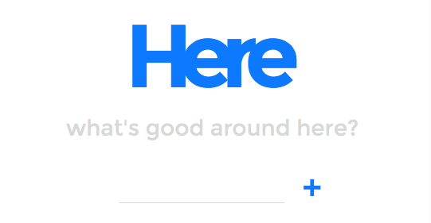

# Here
##What's good around here?




## Technologies Used
- HTML
- CSS
- Vanilla JavaScript
- React
- ReactRouter
- Bootstrap
- Flexbox

## Code Example

```javascript

  componentDidMount() {
    const { neighborhoods } = this.props;
    let neighbKey;
    Object.keys(neighborhoods).map(key => {
      if (neighborhoods[key].name === this.props.details) {
        neighbKey = key;
      }});
    this.setState({selectedNeighb: this.props.neighborhoods[neighbKey]});
    this.setState({key: neighbKey});
  }


```

## Build Strategy

I created a CRUD within a CRUD--users can add, edit and delete neighborhoods, then add, edit, and delete destinations within those neighborhoods. I wanted it to be extremely user-friendly and the narrative of using the app to allow users to add whatever they wanted, whenever they wanted. Many methods were re-used and called from different components. 

## Contributing 

My own damn self (you know who you are). Actually that's just from an Eazy-E record. Ariana helped me a lot, and Vince got in there too!

## Complications/Future Improvements

Authentication, authentication, authentication. Building out the back end so that many people can create profiles and store all of their destinations. Maybe a social aspect where they can view others' destinations. 

## Author

Dain Chatel 
